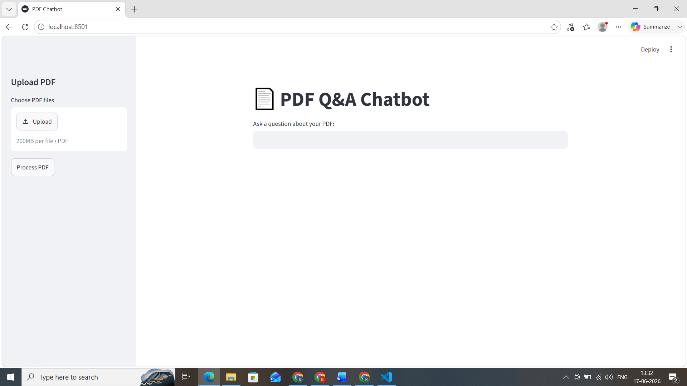
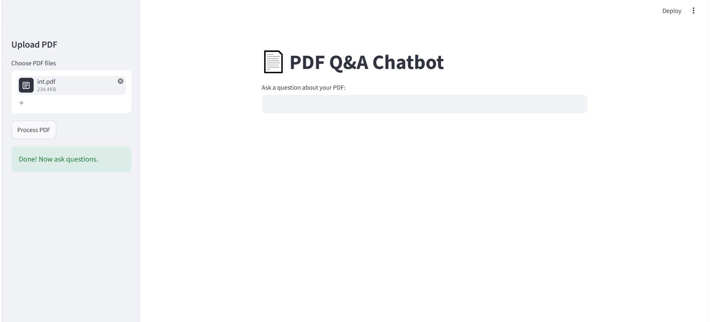
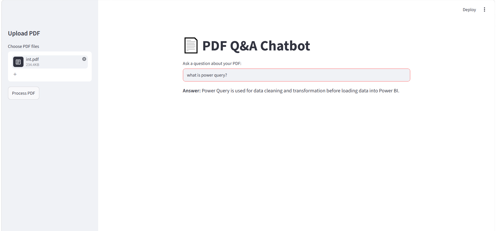

# 📄 PDF Q&A Chatbot

> **Ask anything from your PDF — get instant AI-powered answers.**
> Upload any PDF document and chat with it using LLaMA 3.1 via Groq API.

---

## 📸 Screenshots

### Home Page

### Upload & Process PDF

### Answer Generation

---

## 📌 Problem Statement

Reading long PDF documents to find specific information is time-consuming. This project builds an **AI-powered Q&A chatbot** that lets users upload any PDF and ask questions in natural language — getting accurate, context-aware answers instantly using **RAG (Retrieval Augmented Generation)** architecture.

---

## 🎯 Project Highlights

| What | Detail |
|------|--------|
| 🤖 LLM | LLaMA 3.1 8B via Groq API |
| 📦 Framework | LangChain + Streamlit |
| 🔍 Retrieval | TF-IDF + Cosine Similarity |
| 📄 Input | Any PDF document |
| ⚡ Speed | Ultra-fast responses via Groq |

---

## 🗂️ Project Structure

    pdf-chatbot/
    │
    ├── app.py              # Main Streamlit application
    ├── requirements.txt    # Dependencies
    ├── images/             # Screenshots
    ├── .env                # API keys (not uploaded)
    ├── .gitignore
    └── README.md

---

## 🔄 RAG Pipeline

    Upload PDF → Extract Text → Split Chunks → TF-IDF Search → LLaMA 3.1 → Answer

1. **Upload PDF** — PyPDF2 extracts text from document
2. **Split Chunks** — LangChain splits text into 1000-word chunks
3. **TF-IDF Search** — Finds most relevant chunks for the question
4. **Cosine Similarity** — Ranks chunks by relevance score
5. **LLaMA 3.1** — Generates accurate answer from context
6. **Streamlit UI** — Clean, interactive web interface

---

## 📊 Tech Stack

| Technology | Purpose |
|-----------|---------|
| Python | Core language |
| Streamlit | Web UI |
| LangChain | Text splitting |
| PyPDF2 | PDF text extraction |
| TF-IDF + Cosine Similarity | Semantic search |
| Groq (LLaMA 3.1) | Answer generation |
| Scikit-learn | Vectorization |

---

## ⚙️ How to Run

1. Clone the repository

        git clone https://github.com/keerthanad29/pdf-chatbot.git
        cd pdf-chatbot

2. Create virtual environment

        python -m venv venv
        venv\Scripts\activate

3. Install dependencies

        pip install -r requirements.txt

4. Add your Groq API key in `.env` file

        GROQ_API_KEY=your_key_here

5. Run the app

        streamlit run app.py

---

## 📦 Requirements

- streamlit
- pypdf2
- langchain-text-splitters
- scikit-learn
- numpy
- groq
- python-dotenv

---

## 💡 What I Learned

- Building a **RAG (Retrieval Augmented Generation)** pipeline from scratch
- Using **TF-IDF and Cosine Similarity** for document retrieval
- Integrating **LLaMA 3.1** via Groq API for fast inference
- Building interactive web apps with **Streamlit**
- Importance of **chunking strategy** in document Q&A systems
- Difference between **semantic search vs keyword search**

---

## 🔮 Future Improvements

- [ ] Replace TF-IDF with Vector Embeddings for better semantic search
- [ ] Add chat history and conversation memory
- [ ] Support multiple file formats (DOCX, TXT, CSV)
- [ ] Deploy on Streamlit Cloud for public access
- [ ] Add source citation — show which page the answer came from
